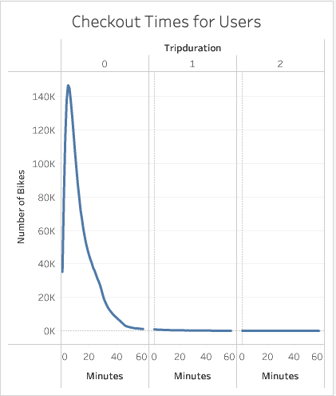
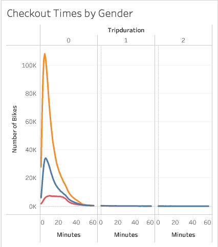
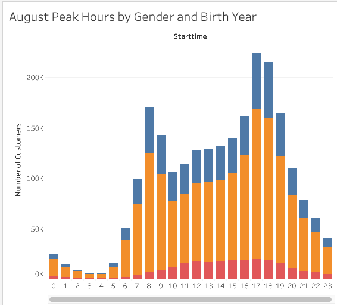
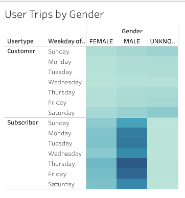
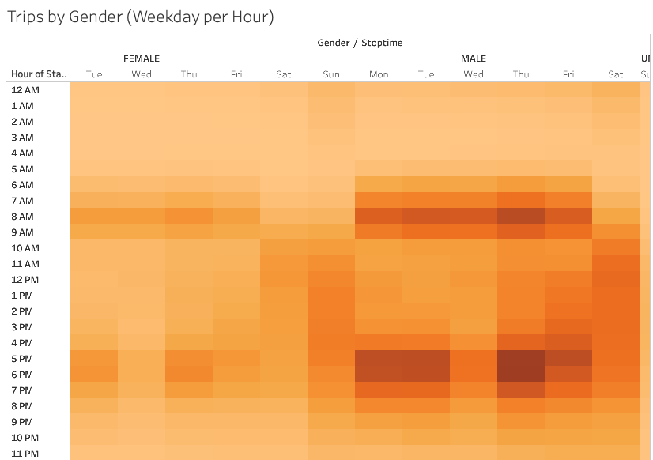
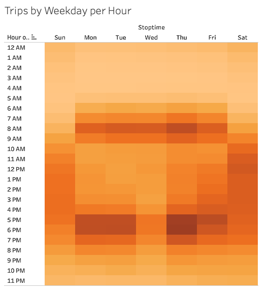
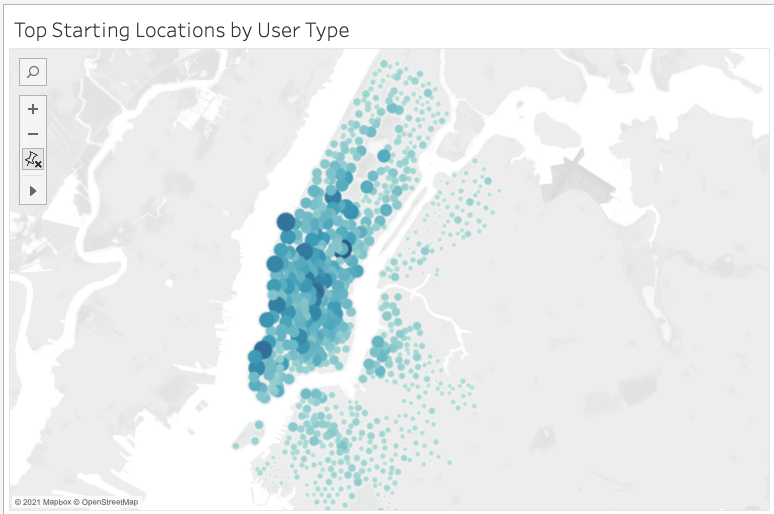

# Report on NYC Citi Bike
Analysis and visualization of Citi Bike Data using Tableau
## Overview 
The purpose of this analysis is to investigate if launching a bike-sharing program in Des Moines, Iowa is a solid business proposal. In order to do this, data from NYC Citi Bike is analyzed. The report created aims to gather insights and determine if the factors involved in the success of the NYC Citi Bike is applicable to Des moines, Iowa.

## Results
* The total number of trips for NYC, in the month of August is 2,344,224.
* From the charts below we can see that bikes are mostly checked out for very short periods. The most common trip duration is about 5 minutes. The number of bikes checked out is less for trip duration that is more than 5 minutes.

   

* The charts show that as the trip duration increases the number of checked out bikes decreases. 
* The pattern is about the same for all genders.
* When we look at the chart that displays the peak hours by gender and birth year, as shown below, we see that the most popular hours for bike rental is between 5:00-6:00 pm for all genders. The second most popular time interval is between 8:00-9:00 am.

 

* The chart also shows that males utilize the bike-sharing service the most.
* When we filter the chart by the birth year we notice that the peak hours for the youngest group(age 16) is different than the rest of the age groups. The peak hour for this age group is 2:00pm. The demand for bikes of this group is high between 2:00-5:00pm. It starts to decrease after 5:00pm.

* The chart below shows the number of trips by gender and user type and the day of the week.

 

* Males rent more bikes than females.
* Subscribers rent more than customers.
* Customers check out bikes mostly on weekends, particularly on Saturdays. The number of bikes checked out for the rest of the weekdays is about the same size.
* Subscribers check out mostly on weekdays. While most weekdays are similarly popular, Thursday and Friday are the most popular days.

* The figure below shows the hours for starttime and stoptime by gender and weekday.
* We can seee that the pattern for this data is very similar between males and females, except for the fact that males rent more than the females.

 

* The 'Trips by Weekday per Hour' below shows that the most popular time for bike-sharing is 6pm on Thursdays.

 

* The symbol map below shows the top starting locations by user type.

 

* When we filter for user type we can see that the top locations change accordingly.
* The most popular locations for customers to rent a bike are Central Park area, Museum Mile, and Manhattan. We determine these locations by Google Maps using the longitudes and latitudes provided.

## Summary
The analysis of the NYC Citi bike data shows that customers are likely to be tourists because the most popular locations for them is the touristic locations. This is also supported by the fact that customers mostly rent bikes during weekends.The subscribers rent considerably more than the customers and their most popular locations are usually in Manhattan, likely business district. This view is also supported by the data that shows that subscribers mostly rent on weekdays. 
Another important outcome is the trip duration. The analysis shows that bikes are mostly rented for short periods of time, mosty less than an hour. This shows that bikes are mostly used as means of getting one place to another within short distances rather than touristic or pleasure purposes.
So, investtors should consider if there will be enough tourists in De Moines to rent out bikes for pleasure. The fact that could potentially determine the number of subscribers is if De Moines has a large enough business districts with short distances. If the people need to travel long distances to get from one place to another, then the data shows that bike-sharing is not a very popular choice. Since the majority of users is subscribers, this is an important factor to consider.
Another insight we gain from the analysis is the that males rent bikes much more than the females. So, gender matters. Trip duration does not vary much with gender. We also notice that while the peak hours is mostly similar for all age groups (5:00-6:00pm), it changes for younbger age, particularly for 16 year olds in which the number of bikes rented start to decrease from 5:00pm onwards. 
For the investors to have a better idea if this investment is profitable they also need some data about De Moines. Demand analysis needs to be made in De Moines if there will be enough demand for bike-sharing service. 
Additional visulization that might help the investors gain more insight could be to determine if there is any meaningful relationship betwen the trip duration and start location. The other one could be on the relationship between trip duration and the type users-if customers have longer trip duration than subscribers.

Please use the following link to go to the Tableau dashboard
[link to dashboard](https://public.tableau.com/views/NYCCitiBikeReport_16268457533070/NYCCitiBikeStory?:language=en-US&publish=yes&:display_count=n&:origin=viz_share_link)